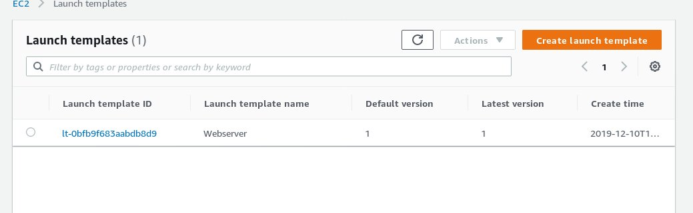

#### Create EC2 inatances using launch templates. Consistent versioned config for faster launches.

>EC2 > Instances > Luanch Templates > Create luanch templates 

#### You can fill out these basic requirements to create your own launch templates

- Launch template name - required 
- Template version description
- Template tags
- Amazon machine image (AMI)
- Instance type
- Key pair (login)
- Networking platform
- Security groups 
- Storage (volumes)
- Instance tags 

